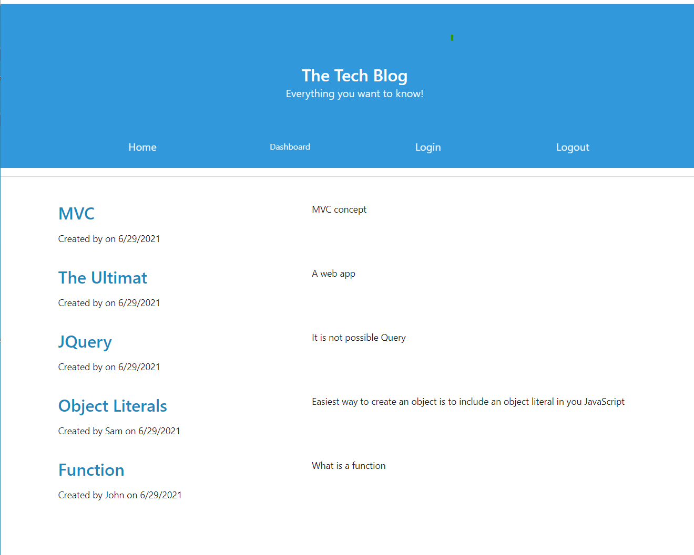
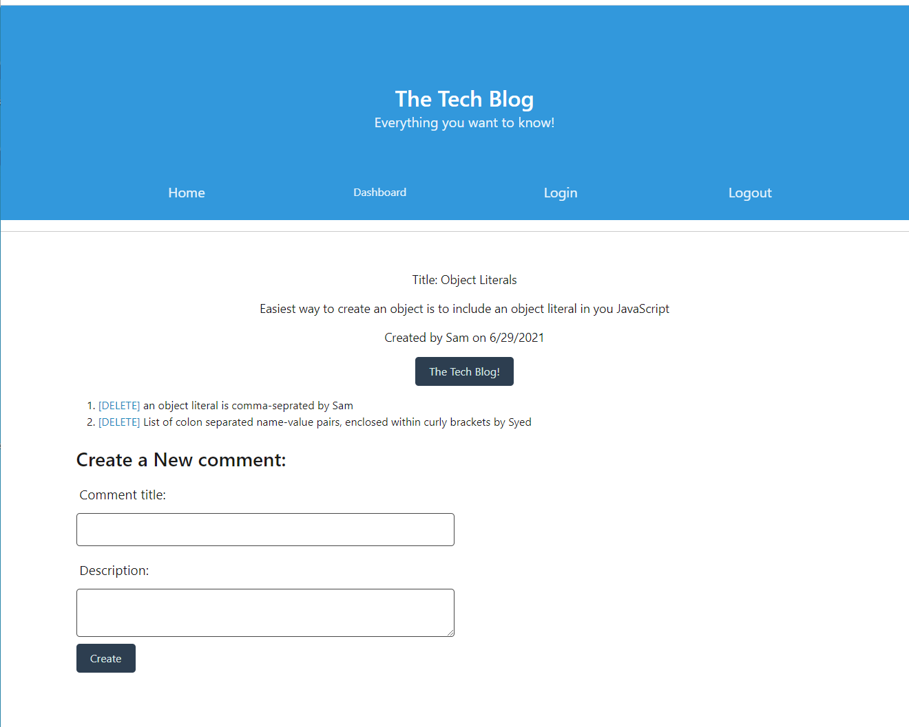
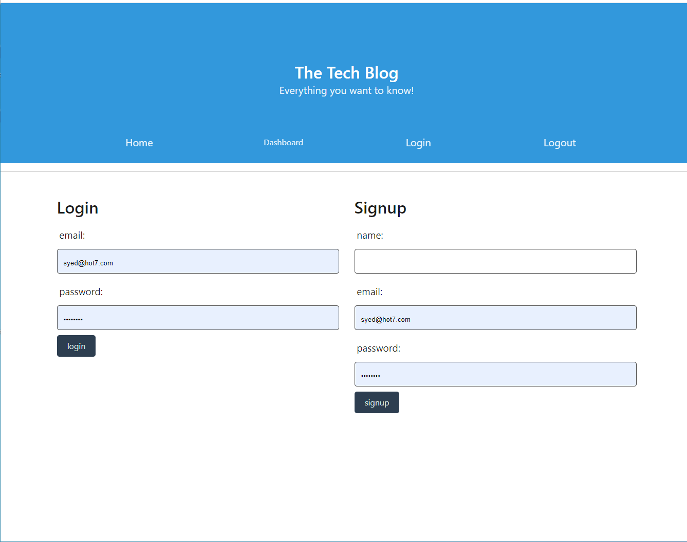
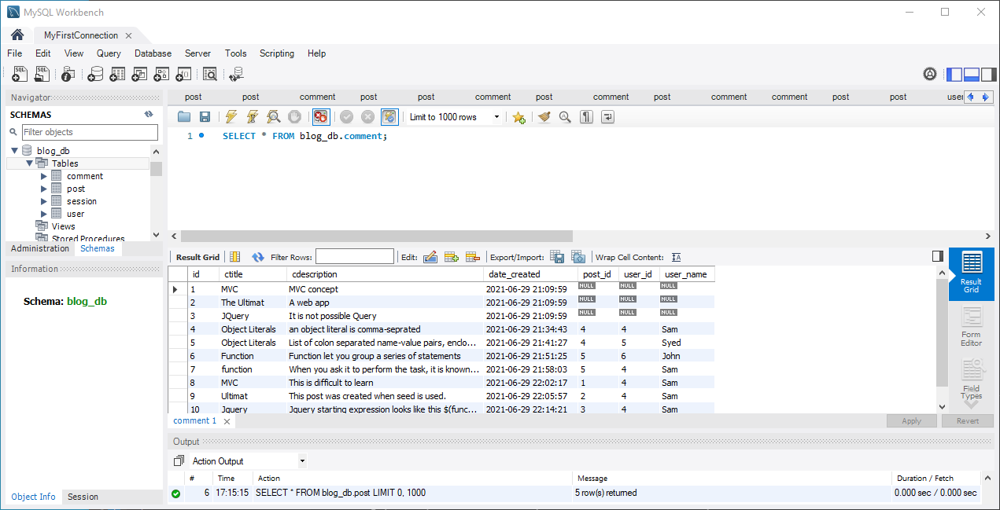

# tech-blog
1. Setting up start-up files
2. Since there was no startup code for this assignment, the miniproject code from class activity was used to built this blog page.
3. Basic routs were built for both Posts & Comments using the simliar api rotes
4. seed.js file is developed to link the mysql data base for posts and comments and users data.
5. Posts section of the blog page is working now.
6. The user need to click on the Dashboard to create a post
7. Comments are added under each post.
8. Comments' creat and delete buttons are also added uder each post.
9. The user need to click on each post in the the home-page  to comment.
10. The user need to sign-up or login to  ceate a post or make any comments
11. password must be 8 charachter long to sign-in
12. An alert message will be raised if login or sign-up criteria is not met
13. Four screen shots are taken to show the functionality of the code. 
14. only who created the post can  delete the post.
15. All Comments will be deleted if post is deleted.
16. A comment can be deleted who created the comment or  could  update it.
16.  
17. This is probably not the best refactoring of mini-project code,but it meets the requiremnsts. 
18. The following are the screen-shots showing the functionality of code how it works.
19. Link to github repository:

https://github.com/rizvi5a/tech-blog

20. The fooling is the web page deployed with Heroku:

https://rizvi-techblog.herokuapp.com/login

20. Post , Comment, log-in page, and MSQL data pages screenshots, respectively.
/img">
/img">
/img">
/img">